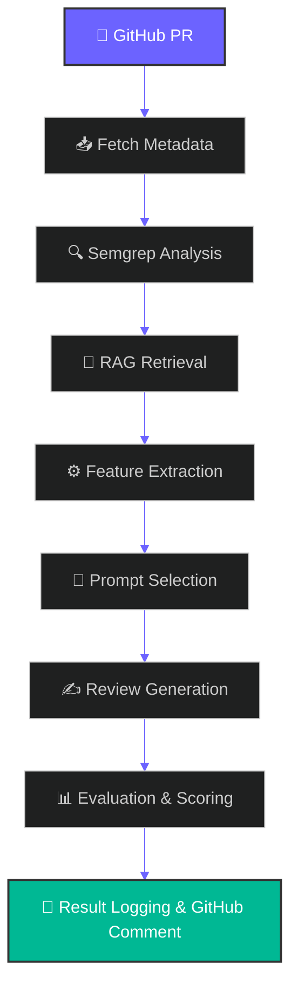
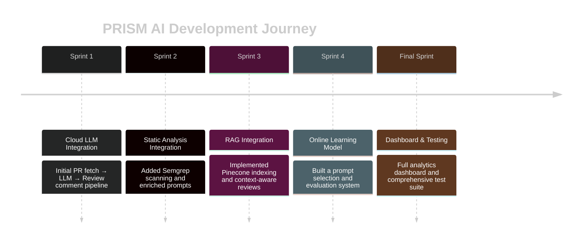

<div align="center">


*Automated code review powered by RAG, Semgrep Static Analysis, Online Learning, and Real-time Analytics*

<br/>


</div>

---

## 📋 Overview


PRISM AI is an AI-powered GitHub Pull Request Review platform that combines Retrieval-Augmented Generation (RAG), Semgrep static analysis, Pinecone vector search, and Groq LLMs to generate intelligent, context-aware code reviews, helping developers improve code quality, security, and maintainability through automated review suggestions and real-time analytics.

### ✨ Key Features

- ✅ **Automated PR Reviews** — Posted directly to GitHub pull requests
- 🔍 **Semgrep Static Analysis** — Security and maintainability checks
- 🧠 **RAG (Retrieval-Augmented Generation)** — Context-aware reviews using Pinecone
- 📈 **Online Learning** — Optimizes prompts based on review quality
- 📊 **Analytics Dashboard** — Real-time visualization of review metrics

> 💡 **Note:** Deploy your own analytics dashboard and link it here once live.

<br clear="right"/>

---

## 🏗️ Architecture



### System Components

1. **PR Pulling** — Fetch metadata and diffs from GitHub
2. **Semgrep Static Analysis** — Run security and maintainability checks
3. **RAG Retrieval** — Retrieve repository context from Pinecone index
4. **Feature Extraction** — Compute structural features from PR diff
5. **Prompt Selection** — Online learning model selects best-performing prompt
6. **Review Generation** — LLM produces structured review
7. **Evaluation System** — Combines heuristic metrics for quality scoring
8. **Result Logging** — Saves structured JSON and markdown files
9. **GitHub Integration** — Posts final review as PR comment

---

## 🚀 Getting Started

### Prerequisites

- Python 3.8+
- Node.js 16+
- GitHub account with API access
- Groq API key
- Pinecone account

### Installation

#### 1. Clone the Repository

```bash
git clone https://github.com/JAIMEENCHAUHAN/PRISM-AI.git
cd PRISM-AI
```

#### 2. Install Backend Dependencies

```bash
pip install -r requirement.txt
```

#### 3. Configure Environment Variables

Create a `.env` file in the root directory:

```env
OWNER=your-github-username
REPO=your-repo-name
GITHUB_TOKEN=your-github-token
GROQ_API_KEY=your-groq-api-key
PINECONE_API_KEY=your-pinecone-api-key
PINECONE_INDEX_NAME=prism-ai-rag
```

#### 4. Run the PR Review Agent

```bash
python main.py
```

#### 5. Run the Dashboard (Optional)

```bash
cd dashboard
npm install
npm run dev:server
npm run dev:client
```

The dashboard will be available at `http://localhost:3000`

---

## 🛠️ Technology Stack

<div align="center">

</div>

<br/>

<div align="center">

| Layer | Technologies |
|---|---|
| **Backend** | Python · FastAPI · GitHub REST API · Groq · Pinecone · Semgrep |
| **Machine Learning** | RAG · Embedding Models · SGDRegressor · Heuristic Evaluation |
| **Frontend** | Next.js 14 · TailwindCSS · ShadCN · Vercel |

</div>

### Backend
- **Python** — Core application logic
- **FastAPI** — API framework
- **GitHub REST API** — PR data fetching
- **Groq** — Cloud-hosted LLMs
- **Pinecone** — Vector database for RAG
- **Semgrep** — Static code analysis

### Machine Learning
- **RAG** — Retrieval-Augmented Generation
- **Embedding Models** — Semantic code understanding
- **SGDRegressor** — Online learning for prompt optimization
- **Heuristic Evaluation** — Review quality scoring

### Frontend
- **Next.js 14** — React framework
- **TailwindCSS** — Styling
- **ShadCN** — UI components
- **Vercel** — Deployment platform

---

## 🧪 Testing Strategy

PRISM AI implements comprehensive testing at multiple levels:

### Test Coverage

- **Unit Testing** — Feature extraction, prompt selection, evaluation scoring
- **Integration Testing** — Full PR-to-review pipeline
- **Static Testing** — Semgrep rule validation
- **Black-Box Testing** — Randomized diffs and multi-language tests
- **Performance Testing** — Load and spike testing for large PRs
- **GUI Testing** — Dashboard component and page-level testing

---

## 📊 System Capabilities

### AI Review Engine
- Cloud-hosted LLM inference via Groq
- Structured, context-aware feedback generation
- Multi-source input integration (diff, static analysis, RAG context)

### Semgrep Static Analysis
- Vulnerability detection
- Code quality issue identification
- Security pattern matching

### RAG System
- Repository-level code indexing
- Document and configuration file embedding
- Query-based context retrieval via Pinecone

### Online Learning
- SGDRegressor-based prompt optimization
- Multi-feature learning (PR stats, static analysis, evaluation scores)
- Continuous performance improvement

### Analytics Dashboard
- Evaluation summaries and trends
- Shows the latest AI review to the PR

---

## 📈 Development Timeline



### Sprint 1: Cloud LLM Integration
Initial PR fetch → LLM → Review comment pipeline

### Sprint 2: Static Analysis Integration
Added Semgrep scanning and enriched prompts

### Sprint 3: RAG Integration
Implemented Pinecone indexing and context-aware reviews

### Sprint 4: Online Learning Model
Built a prompt selection and evaluation system

### Final Sprint: Dashboard & Testing
Full analytics dashboard and comprehensive test suite

---

## 🔮 Future Roadmap


### Planned Enhancements

- **Local/Offline Processing** — Migration to local LLMs (Ollama) for private reviews
- **Performance Optimization** — Reduced RAG latency and cached embeddings
- **Advanced Features**
  - Automatic PR labeling
  - Repository-level audit reports
  - Background workers for large-scale scanning

<br clear="right"/>

---

<div align="center">

**Built with ❤️ using FastAPI, Next.js, Pinecone, Semgrep, Groq, and Retrieval-Augmented Generation (RAG)**


</div>
