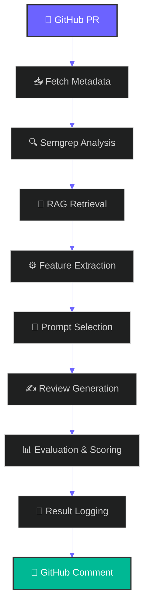
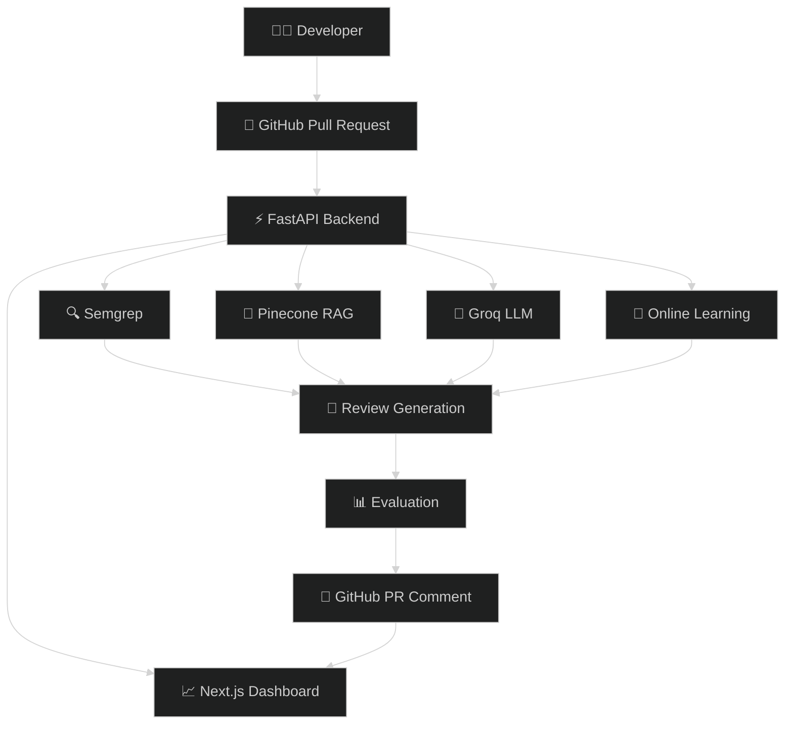
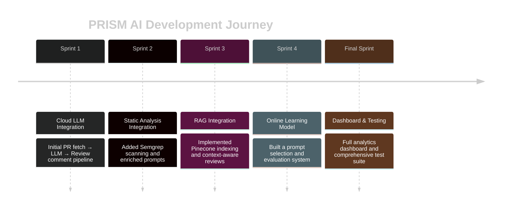

<div align="center">


*Automated code review powered by RAG, Semgrep Static Analysis, Online Learning, and Real-time Analytics*

<br/>


</div>

---

## 📋 Overview


PRISM AI is an AI-powered GitHub Pull Request Review platform that combines Retrieval-Augmented Generation (RAG), Semgrep static analysis, Pinecone vector search, and Groq LLMs to generate intelligent, context-aware code reviews.

It helps developers improve code quality, security, and maintainability by automatically analyzing pull requests, retrieving repository context, generating structured review feedback, and presenting review insights through an analytics dashboard.

### ✨ Key Features

- ✅ **Automated PR Reviews** — Posts review feedback directly to GitHub pull requests
- 🔍 **Semgrep Static Analysis** — Performs security and maintainability checks
- 🧠 **RAG (Retrieval-Augmented Generation)** — Uses repository context for context-aware reviews
- 📈 **Online Learning** — Optimizes prompt selection based on review quality
- 📊 **Analytics Dashboard** — Visualizes review results and evaluation metrics
- 🔗 **GitHub Integration** — Fetches pull request data and posts generated feedback through GitHub APIs
- 🧩 **Modular Processing Pipeline** — Separates analysis, retrieval, generation, evaluation, and logging into distinct stages

<br clear="right"/>

---

## 🔄 End-to-End Review Flow

```text
GitHub Pull Request
        │
        ▼
   PR Data Fetch
        │
        ▼
 Semgrep Static Analysis
        │
        ▼
 Repository Context Retrieval
        │
        ▼
  Feature Extraction
        │
        ▼
   Prompt Selection
        │
        ▼
   LLM Review Generation
        │
        ▼
 Evaluation & Scoring
        │
        ▼
 GitHub Review Comment
        │
        ▼
 Analytics Dashboard
```

---

## 🏗️ Architecture

### Review Processing Pipeline



### System Architecture



### System Components

1. **PR Pulling** — Fetch metadata and diffs from GitHub
2. **Semgrep Static Analysis** — Run security and maintainability checks
3. **RAG Retrieval** — Retrieve repository context from the Pinecone index
4. **Feature Extraction** — Compute structural features from the PR diff
5. **Prompt Selection** — Online learning model selects the best-performing prompt
6. **Review Generation** — LLM produces structured review feedback
7. **Evaluation System** — Combines heuristic metrics for review-quality scoring
8. **Result Logging** — Saves structured JSON and markdown results
9. **GitHub Integration** — Posts the final review as a PR comment
10. **Analytics Dashboard** — Displays review results and analytics

---

## ⚡ Scalability & Reliability

PRISM AI is organized as a modular processing pipeline so individual stages can be developed, tested, and improved independently.

### Key Engineering Considerations

- **Modular Pipeline** — Each processing stage has a defined responsibility.
- **API-based Architecture** — Backend functionality is exposed through FastAPI.
- **External Service Integration** — GitHub, Pinecone, Groq, and Semgrep are integrated as independent components.
- **Repository Context Retrieval** — RAG retrieves relevant repository information to support review generation.
- **Large PR Handling** — Static analysis, retrieval, feature extraction, and generation are separated into individual processing stages.
- **Result Logging** — Structured review results are logged for evaluation and analytics.
- **Independent Frontend and Backend** — The Next.js dashboard and FastAPI backend are separated for independent development and deployment.

---

## 🧠 Engineering Approach

PRISM AI combines deterministic software analysis with AI-based reasoning.

```text
Deterministic Analysis
        │
        ▼
     Semgrep
        │
        ├──────────────┐
        │              │
        ▼              ▼
 Static Findings   Repository Context
        │              │
        └───────┬──────┘
                ▼
               RAG
                │
                ▼
             Groq LLM
                │
                ▼
        Structured Review
                │
                ▼
          Evaluation
```

### Why this approach?

- **Semgrep** provides deterministic static-analysis findings.
- **RAG** provides repository-specific context.
- **LLM generation** converts analysis and context into developer-friendly feedback.
- **Evaluation** provides signals for the online learning component.
- **Modular stages** make individual components easier to test and improve.

---

## 🚀 Getting Started

### Prerequisites

- Python 3.8+
- Node.js 16+
- GitHub account with API access
- Groq API key
- Pinecone account

### Installation

#### 1. Clone the Repository

```bash
git clone https://github.com/JAIMEENCHAUHAN/PRISM-AI.git
cd PRISM-AI
```

#### 2. Install Backend Dependencies

```bash
pip install -r requirement.txt
```

> If the dependency file in the repository is named `requirements.txt`, use:
>
> ```bash
> pip install -r requirements.txt
> ```

#### 3. Configure Environment Variables

Create a `.env` file in the root directory:

```env
OWNER=your-github-username
REPO=your-repo-name
GITHUB_TOKEN=your-github-token
GROQ_API_KEY=your-groq-api-key
PINECONE_API_KEY=your-pinecone-api-key
PINECONE_INDEX_NAME=prism-ai-rag
```

#### 4. Run the PR Review Agent

```bash
python main.py
```

#### 5. Run the Dashboard

```bash
cd dashboard
npm install
npm run dev:server
npm run dev:client
```

The dashboard will be available at:

```text
http://localhost:3000
```

---

## 🛠️ Technology Stack

<div align="center">


</div>

<br/>

<div align="center">

| Layer | Technologies |
|---|---|
| **Backend** | Python · FastAPI · GitHub REST API · Groq · Pinecone · Semgrep |
| **Machine Learning** | RAG · Embedding Models · SGDRegressor · Heuristic Evaluation |
| **Frontend** | Next.js 14 · TailwindCSS · ShadCN · Vercel |

</div>

### Backend

- **Python** — Core application logic
- **FastAPI** — API framework
- **GitHub REST API** — Pull request data and GitHub integration
- **Groq** — Cloud-hosted LLM inference
- **Pinecone** — Vector database for RAG
- **Semgrep** — Static code analysis

### Machine Learning

- **RAG** — Retrieval-Augmented Generation
- **Embedding Models** — Semantic code understanding
- **SGDRegressor** — Online learning for prompt optimization
- **Heuristic Evaluation** — Review quality scoring

### Frontend

- **Next.js 14** — React framework
- **TailwindCSS** — Styling
- **ShadCN** — UI components
- **Vercel** — Deployment platform

---

## 🧪 Testing Strategy

PRISM AI implements testing at multiple levels to validate individual components and the complete review workflow.

### Test Coverage

| Testing Level | What is Tested |
|---|---|
| **Unit Testing** | Feature extraction, prompt selection, evaluation scoring |
| **Integration Testing** | Full PR-to-review pipeline |
| **Static Testing** | Semgrep rule validation |
| **Black-Box Testing** | Randomized diffs and multi-language tests |
| **Performance Testing** | Load and spike testing for large PRs |
| **GUI Testing** | Dashboard components and page-level testing |

### Test Results

Add your latest **actual** test results here after running the test suite.

```text
Unit Tests:        XX passed
Integration Tests: XX passed
Static Analysis:   XX
Performance:       XX
GUI Tests:         XX
```

> Replace the `XX` values with results from the actual test suite. Do not use estimated values.

---

## 📊 Performance & Benchmarking

PRISM AI includes performance testing for large pull requests and load/spike scenarios.

### Benchmark

Add measured results here after running the benchmark suite:

| Metric | Result |
|---|---:|
| Average review latency | XX sec |
| RAG retrieval latency | XX ms |
| Large PR processing time | XX sec |
| Average diff size tested | XX lines |
| Concurrent requests tested | XX |

> Benchmark values should represent actual measurements from the current implementation.

---

## 📊 System Capabilities

### AI Review Engine

- Cloud-hosted LLM inference via Groq
- Structured, context-aware feedback generation
- Multi-source input integration
- Pull request diff analysis
- Static analysis findings
- Repository context through RAG

### Semgrep Static Analysis

- Vulnerability detection
- Code quality issue identification
- Security pattern matching
- Static findings integrated into the review-generation process

### RAG System

- Repository-level code indexing
- Document and configuration file embedding
- Query-based context retrieval through Pinecone
- Repository-specific context for review generation

### Online Learning

- SGDRegressor-based prompt optimization
- Multi-feature learning
- PR statistics and evaluation signals
- Prompt selection based on available review-quality signals

### Analytics Dashboard

- Evaluation summaries and trends
- Latest AI-generated review
- Review analytics visualization

---

## 🔗 API & Integrations

PRISM AI integrates multiple external systems through APIs.

### GitHub

Used for:

- Pull request metadata
- Pull request diffs
- Repository information
- Posting generated review feedback

### Pinecone

Used for:

- Vector storage
- Repository context retrieval
- Semantic search

### Groq

Used for:

- LLM inference
- Structured review generation

### Semgrep

Used for:

- Static code analysis
- Security and maintainability checks

---

## 📈 Development Timeline



### Sprint 1: Cloud LLM Integration

Initial PR fetch → LLM → Review comment pipeline

### Sprint 2: Static Analysis Integration

Added Semgrep scanning and enriched prompts

### Sprint 3: RAG Integration

Implemented Pinecone indexing and context-aware reviews

### Sprint 4: Online Learning Model

Built a prompt selection and evaluation system

### Final Sprint: Dashboard & Testing

Built the analytics dashboard and comprehensive test suite

---

## 📁 Project Structure

> Keep this section synchronized with the actual repository structure.

```text
PRISM-AI/
│
├── dashboard/
├── tests/
├── main.py
├── requirement.txt
├── .env.example
└── README.md
```

> If your repository uses different filenames or folders, update this section to match the actual structure.

---

## 🔐 Security

- API credentials are configured through environment variables.
- Sensitive keys should never be committed to the repository.
- GitHub tokens should be stored securely.
- `.env` files should remain excluded from version control.

---

## 🔮 Future Roadmap

### Planned Enhancements

- **Local/Offline Processing** — Migration to local LLMs such as Ollama for private reviews
- **Advanced PR Automation**
  - Automatic PR labeling
  - Repository-level audit reports
  - Automated review summaries
- **Scalable Processing**
  - Background workers for large-scale scanning
  - Further optimization of RAG retrieval and processing
- **Advanced Analytics**
  - Historical repository-level trends
  - Developer/team-level review insights

---

## 💡 Key Engineering Highlights

PRISM AI demonstrates the integration of:

```text
GitHub APIs
     +
Static Code Analysis
     +
Vector Search / RAG
     +
LLM Inference
     +
Online Learning
     +
Automated Evaluation
     +
Analytics
```

The system combines deterministic software-analysis techniques with AI-based reasoning to create an automated pull-request review workflow.

---

<div align="center">

**Built with ❤️ using FastAPI, Next.js, Pinecone, Semgrep, Groq, and Retrieval-Augmented Generation (RAG)**

<br/>


</div>
